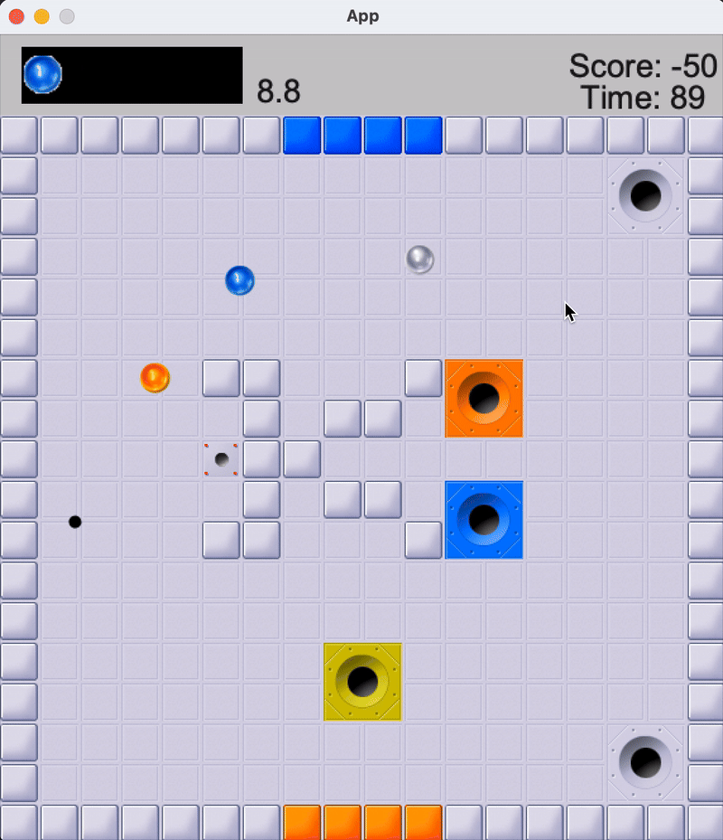

# Inkball | Java & Gradle

This project is a recreation of the inkball game. It was entirely created in Java, using Gradle. Sprites were provided and processing libraries were used. Other than that, this project was created from scratch.
Collision is not perfect in this version. Created and submitted for a University assignment.



## How to Run
Download the repository and run:

```gradle run```

(Make sure you have Gradle)

## Controls
- **Left-Click**: To draw
- **Right-click**: To erase
- **Spacebar**: To pause/unpause
- **'R'**: Restart your game


